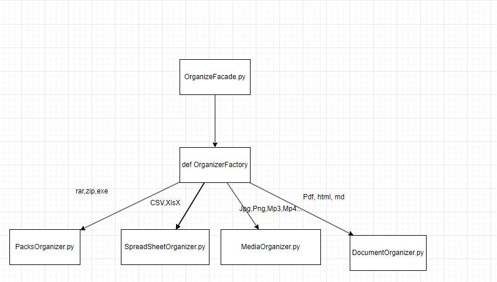

# Veranstalter

## Folder organizer, because mine are a mess...


```console
    python -m venv venv
```

### Windows

```bat
    venv\Scripts\activate
```

### Linux

```bash
    source venv/bin/activate
``` 

## Tests

- Every test file must be in the /tests folder at the root of the project
- Every test class should follow the format Test****.py
- Every test file should follow the format **_test.py

```bash
    pytest tests
```

## Libraries used
- [typer](https://typer.tiangolo.com/)
- [python-fsutil](https://pypi.org/project/python-fsutil/)
- [pytest](https://docs.pytest.org/en/stable/index.html)
- [pytest-mock](https://pypi.org/project/pytest-mock/)


## Example Commands

```bash
    python main.py organize organize-by-extension D:\downloads
```

## Workflows 

